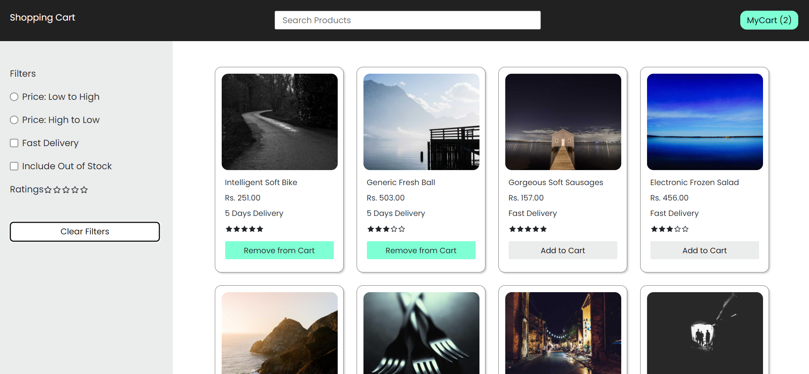
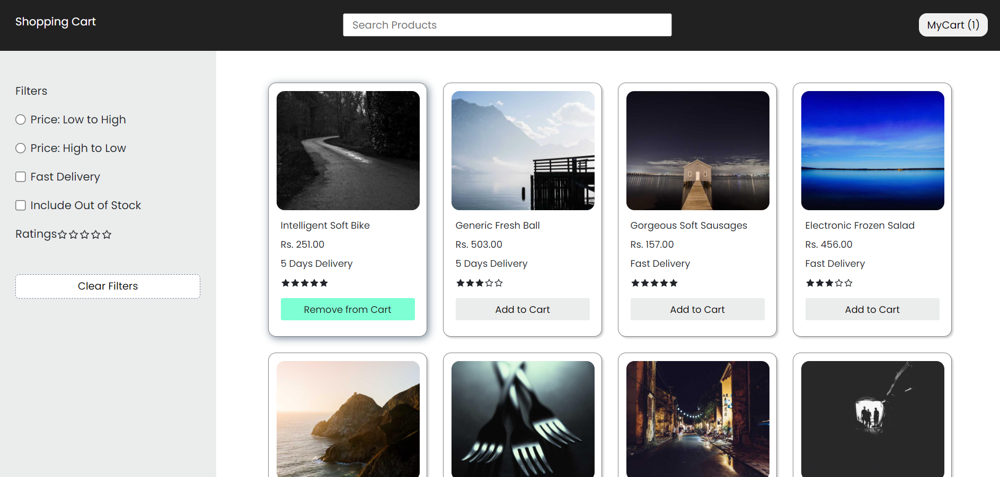
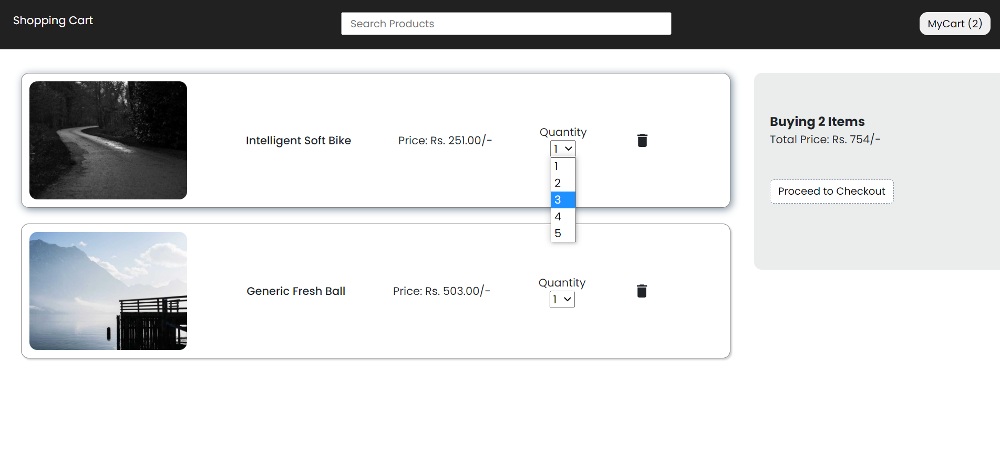

# Shopping Cart ReactJs
Shopping Cart App developed in Reactjs
[Click here! to check the live app.](https://shopping-cart-reactjs-e9422.web.app/)

### Tools used:
* ReactJs
* Vite
* Context API (useContext() Hook)
* Reducer (useReducer() Hook)
* Faker (to generate random products data and random images)
* React-Router-Dom for routing of App.
* Firebase Hosting to Deploy App.

### Features included
* Displays list of products, with products price, ratings, days of delivery etc.
* Add to cart, Remove from cart option.
* Filters on Sort by Price, Fast Delivery, Include Out of Stock Products and Ratings!
* Input Search Implementation. 
* Option to increase the Quantity of Product in MyCart.
* Responsive layout for mobile.

### Screenshots

